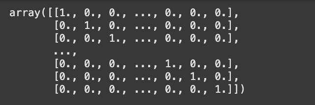
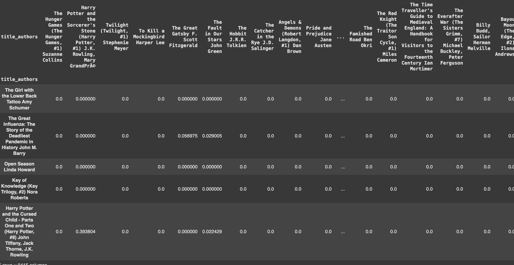
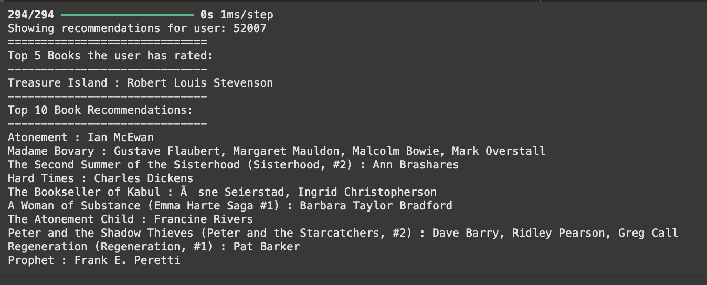
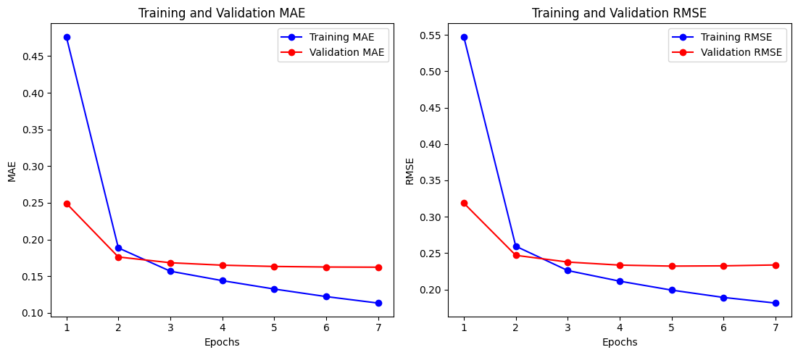

# Laporan Proyek Machine Learning - Ikrar Bagaskara

---

## 1.  Project Overview

Buku merupakan salah satu media pembelajaran yang kaya akan pengetahuan. Namun, dengan kemajuan teknologi yang pesat, keberadaan buku fisik mulai tergantikan. Hal ini terlihat dari penurunan minat baca serta pergeseran ke format digital seperti *e-book*. Ada juga faktor lain seperti penggunaan *gadget*  ataupun fasilitas perpustakaan yang kurang memadai [[1]](https://sihojurnal.com/index.php/identik/article/view/50). Menyikapi perubahan ini, banyak penerbit dan penyedia buku seperti *Gramedia* dan *Intan Pariwara* mulai menjual buku melalui platform *marketplace* atau menyediakan opsi *e-book*.

Perubahan tersebut juga menimbulkan tantangan baru, terutama dalam memberikan rekomendasi buku yang sesuai dengan preferensi pembaca. Tidak seperti film yang memiliki *trailer* untuk memberikan gambaran awal, buku umumnya hanya menyediakan sinopsis, sehingga menyulitkan pembaca, terutama pemula dalam memilih bacaan yang tepat. Proses pemilihan secara manual pun bisa memakan waktu.

Untuk mengatasi tantangan ini, pendekatan *machine learning* diusulkan dalam membangun sistem rekomendasi buku yang bersifat personal. Sistem ini akan menggabungkan dua metode utama, yaitu *Content-Based Filtering* yang memanfaatkan informasi seperti judul dan penulis [[2]](https://online-journals.org/index.php/i-jet/article/view/18851), serta *Collaborative Filtering* yang menganalisis pola interaksi antar pengguna [[3]](https://www.informatica.si/index.php/informatica/article/view/6950). Pendekatan ini diharapkan dapat meningkatkan relevansi rekomendasi dan mendorong minat baca pengguna.

### 1.1. Mengapa masalah ini penting?

* **Meningkatkan kenyamanan pengguna:** Sistem rekomendasi dapat membantu pengguna menemukan buku yang sesuai dengan minat dan preferensi mereka tanpa harus mencari secara manual, sehingga pengalaman membaca menjadi lebih personal dan menyenangkan.
* **Efisiensi waktu dan eksplorasi konten:** Dengan banyaknya pilihan buku yang tersedia, pengguna sering kali kesulitan memilih bacaan yang tepat. Rekomendasi otomatis memungkinkan pengguna menjelajahi berbagai buku yang relevan secara efisien, tanpa harus menelusuri seluruh katalog.
* **Mendukung industri perbukuan:** Bagi penerbit dan platform penjual buku, sistem rekomendasi dapat mendorong penjualan dengan menyajikan buku-buku yang relevan kepada pengguna, sehingga meningkatkan berpotensi meningkatkan penjualan.
* **Pemanfaatan teknologi:** Penerapan teknik seperti *Content-Based Filtering* dan *Collaborative Filtering* menunjukkan bagaimana *machine learning* dapat dimanfaatkan untuk mengatasi tantangan dala literasi, serta menjadi solus di era digital.

## 2. Business Understanding

---

Sistem rekomendasi buku memainkan peran vital dalam mempermudah pengguna menemukan buku yang sesuai dengan minat mereka. Dari perspektif bisnis, penting untuk memahami kebutuhan pengguna secara menyeluruh dan memastikan sistem mampu memberikan rekomendasi yang tepat sasaran. Di tengah menurunnya minat baca, perusahaan dituntut untuk mengeksplorasi berbagai strategi agar tetap relevan dengan perkembangan zaman. Situasi ini menekankan urgensi keberadaan sistem rekomendasi yang efektif dan personal dalam menyarankan buku kepada pengguna.

### 2.1. Problem Statements

Berdasarkan latar belakang di atas, beberapa permasalahan yang dapat dirumuskan adalah sebagai berikut:

1. Bagaimana cara melakukan proses pengolahan data yang optimal agar dapat digunakan dalam pembangunan sistem rekomendasi buku yang efektif?
2. Bagaimana cara membangun sistem rekomendasi dengan melihat kemiripan dari buku-buku yang telah disukai oleh pengguna sebelumnya?
3. Bagaimana cara membangun sistem rekomendasi dengan melihat preferensi antar pengguna dalam memilih buku?

### 2.2. Goals

Untuk mencapai tujuan di atas, beberapa solusi yang diusulkan adalah:

1. Mengolah dan menyiapkan data secara efisien agar dapat dimanfaatkan dalam pembangunan sistem rekomendasi buku.
2. Mengembangkan sistem rekomendasi yang mampu menyarankan buku dengan karakteristik serupa dari buku-buku yang telah disukai pengguna.
3. Membangun sistem rekomendasi yang mampu mengenali preferensi pengguna lain yang memiliki kesamaan minat, untuk memberikan saran buku yang relevan.

### 2.3. Solution Statements

1. Menerapkan teknik *Exploratory Data Analysis (EDA)* dan *Data Preparation* untuk memahami struktur data serta melakukan pembersihan, transformasi, dan seleksi data yang relevan dalam konteks buku.
2. Menggunakan pendekatan *Content-Based Filtering* dengan memanfaatkan fitur seperti *authors* dan *title* untuk merekomendasikan buku berdasarkan kemiripan karakteristik dengan buku-buku yang sebelumnya disukai oleh pengguna.
3. Menerapkan pendekatan *Model-Based Collaborative Filtering* berbasis deep learning dengan menggunakan fitur  *user_id*, *book_id*, dan *rating* untuk memberikan rekomendasi buku berdasarkan pola kesamaan antar pengguna.

## 3. Data Understanding

---

Dalam proyek ini, digunakan dataset [goodbooks-10k](https://www.kaggle.com/datasets/zygmunt/goodbooks-10k/data) yang diambil langsung dari Kaggle. Dataset ini berisi informasi mengenai sepuluh ribu buku termasuk rating yang diberikan, author atau penulis, judul original, dan sebagainya. Secara keseluruhan dataset ini sebenarnya memiliki beberapa dataset seperti `book_tag.csv`, `books.csv`, `ratings.csv`, `tags.csv`, dan, `to_read.csv`. Tapi pada project ini, hanya menggunakan dataset `books.csv` untuk keperluan *Content-Based Filtering* dan dataset `ratings.csv` untuk keperluan *Collaborative-Based Filtering*

Tujuan dari penggunaan dataset ini adalah untuk membangun model yang mampu merekomendasikan buku berdasarkan fitur yang telah ditetapkan.

### 3.1. Dataset books.csv

---

#### 3.1.1. Tautan Dataset

[https://www.kaggle.com/datasets/zygmunt/goodbooks-10k/data?select=books.csv](https://www.kaggle.com/datasets/zygmunt/goodbooks-10k/data?select=books.csv)

#### 3.1.2. Deskripsi Dataset

* Dataset ini terdiri dari 10.000 baris data dengan 16 fitur numerikal dan 7 fitur object.

#### 3.1.3. Kondisi Dataset

* Tidak memiliki tidak memiliki *missing value,* dengan detail
  * *isbn: 700 missing value*
  * *original_publication_year: 21 missing value*
  * *original_title: 585 missing value*
  * *language_code: missing value*
* Meskipun fitur-fitur di atas tidak digunakan dalam pembangunan model saat ini, proses pembersihan data tetap dilakukan. Hal ini bertujuan agar jika fitur-fitur tersebut diperlukan di masa depan untuk pengembangan model, sehingga tidak perlu mengubah struktur atau alur kerja notebook yang telah dibuat, atau dengan kata lain meningkatkan fleksibilitas di masa depan.

#### 3.1.4. Fitur Dataset

| Nama Fitur Deskripsi                | Deskripsi                                           |
| ----------------------------------- | --------------------------------------------------- |
| **id**                        | ID unik untuk dataset buku.                         |
| **book_id**                   | ID unik identifikasi buku.                         |
| **best_book_id**              | ID buku yang dianggap terbaik dalam dataset.        |
| **work_id**                   | ID yang menghubungkan buku dengan karya terkait.    |
| **books_count**               | Jumlah buku dalam seri yang sama.                   |
| **isbn**                      | Nomor ISBN buku.                                    |
| **isbn13**                    | Nomor ISBN versi 13-digit.                          |
| **authors**                   | Penulis atau pengarang buku.                        |
| **original_publication_year** | Tahun terbit buku.                                  |
| **original_title**            | Judul asli buku.                                    |
| **title**                     | Judul buku yang ada di-dalam dataset.              |
| **language_code**             | Kode bahasa pada buku.                              |
| **average_rating**            | Rata-rata rating pada buku.                         |
| **ratings_count**             | Jumlah rating pada buku.                            |
| **work_ratings_count**        | Jumlah rating untuk seluruh karya terkait buku ini. |
| **work_text_reviews_count**   | Jumlah ulasan yang diterima buku ini.               |
| **ratings_1**                 | Jumlah rating dengan nilai 1.                       |
| **ratings_2**                 | Jumlah rating dengan nilai 2.                       |
| **ratings_3**                 | Jumlah rating dengan nilai 3.                       |
| **ratings_4**                 | Jumlah rating dengan nilai 4.                       |
| **ratings_5**                 | Jumlah rating dengan nilai 5.                       |
| **image_url**                 | URL gambar sampul buku                              |
| **small_image_url**           | URL gambar sampul buku versi kecil.                 |

### 3.2. Dataset ratings.csv

---

#### 3.2.1. Tautan Dataset

[https://www.kaggle.com/datasets/zygmunt/goodbooks-10k/data?select=ratings.csv](https://www.kaggle.com/datasets/zygmunt/goodbooks-10k/data?select=ratings.csv)

#### 3.2.2. Deskripsi Dataset

* Dataset ini terdiri dari 98.1756 baris data dengan 3 fitur numerikal.

#### 3.2.3. Kondisi Dataset

* Tidak memiliki tidak memiliki *missing value,* sehingga semua kolom memiliki isi yang lengkap.

#### 3.2.4. Fitur Dataset

| Nama Fitur        | Deskripsi                                     |
| ----------------- | --------------------------------------------- |
| **book_id** | ID unik indetifikasi buku.                   |
| **user_id** | ID unik indetifikasi pengguna.               |
| **rating**  | Penilaian yang diberikan pengguna pada buku. |

### 3.3. Exploratory Data Analysis

#### 3.3.1. Books


* Menampilkan distribusi rating untuk setiap buku dan mengamati bahwa mayoritas buku memiliki rating di angka 4. Hal ini menunjukkan bahwa ada kecenderungan pembaca untuk memberikan rating tinggi (di angka 4) pada buku. Bisa jadi ini mencerminkan kualitas dari buku yang dibaca.


* Pengarang `Stephen King` adalah pengarang terpopuler disusul oleh `Nora Roberts`, kedua pengarang ini menulis buku dengan jumlah hampir menyentuh diangka 60. Hal ini menunjukkan bahwa mereka sangat produktif dan memiliki banyak karya yang dikenal luas oleh pembaca. Hal ini bisa mencerminkan hal penting:

  * **Jenis Buku yang Ditulis** : Stephen King dikenal dengan genre horor dan thriller yang populer di kalangan banyak pembaca, sementara Nora Roberts dikenal dengan novel romantis yang juga sangat diminati, sehingga kedua pengarang ini menarik perhatian pembaca dari berbagai genre.

#### 3.3.2. Ratings


* Rating 4 yang mendominasi menunjukkan bahwa mayoritas pembaca merasa puas dengan buku-buku dalam dataset ini, disusul oleh rating dengan nilai 5, ini menunjukan bahwa banyak dari buku mendapatkan apreasiasi positif dan bisa juga buku-buku ini memiliki kualitas baik sehingga pengguna tidak ragu memberikan rating-rating yang tinggi.


* Visualisasi menunjukkan bahwa sebagian besar pengguna hanya memberikan sedikit rating, dengan distribusi yang condong ke kanan (right-skewed). Ini berarti mayoritas pengguna tidak terlalu aktif, sementara hanya sedikit pengguna yang memberikan banyak rating.

## 4. Data Preparation

---

### 4.1. Dataset books.csv

#### 4.1.1. Mengatasi Missing Values dan Menghapus Fitur yang Tidak Diperlukan

Tujuan:  Membersihkan data dari *missing values* dan fitur-fitur yang tidak relevan agar tidak mengganggu proses pelatihan model. Dengan memastikan bahwa dataset hanya berisi informasi yang lengkap dan berguna, proses pelatihan model dapat berjalan lebih efisien serta menghasilkan hasil rekomendasi yang lebih akurat dan andal.

* Menghapus nilai kosong pada fitur `original_title`

```python
books=books.dropna(subset=['original_title'])
```

* Menghapus fitur yang tidak diperlukan untuk dataset `books.csv`, yaitu `isbn` dan `isbn13`

```python
books=books.drop(columns=['isbn', 'isbn13'])
```

* Mengisi nilai kosong (`NaN`) pada kolom `original_publication_year` dengan nilai **median** dari kolom tersebut.

  ```python
  books['original_publication_year'].fillna(books['original_publication_year'].median(), inplace=True)
  ```
* Mengisi nilai kosong pada kolom `language_code` dengan nilai **modus** (nilai yang paling sering muncul) dari kolom tersebut.

  ```python
  books['language_code'] = books['language_code'].fillna(books['language_code'].mode()[0])
  ```
* Mengganti nilai kosong pada kolom `image_url` dengan string `'No Image'`.

  ```python
  books['image_url'] = books['image_url'].fillna('No Image')
  ```

### 4.2. Dataset ratings.csv

#### 4.2.1.  Normalisasi Fitur Rating

Menormalisasi fitur rating sehingga model deep learning dapat lebih efektif dalam mendeteksi pola, dan juga dapat mempercepat pelatihan.

```python
min_rating = ratings['rating'].min()
max_rating = ratings['rating'].max()

ratings['rating_norm'] = (ratings['rating'] - min_rating) / (max_rating - min_rating)
```

#### 4.2.2. Memetakan Nilai Unik

Proses dibawah ini adalah mapping atau memetakan nilai unik dari kolom user_id dan book_id ke indeks numerik yang lebih sederhana. . Hal ini penting agar data bisa digunakan sebagai input dalam model machine learning, khususnya model berbasis deep learning atau *matrix factorization* yang memerlukan input numerik dan berurutan.

```python
user_mapping = {id:i for i, id in enumerate(ratings['user_id'].unique())}
book_mapping = {id:i for i, id in enumerate(ratings['book_id'].unique())}

ratings['user'] = ratings['user_id'].map(user_mapping)
ratings['book'] = ratings['book_id'].map(book_mapping)
```

#### 4.2.3. Pemisahan Data

Memisahkan data dengan proporsi 80/10/10, dengan begini model dapat dilatih dengan data yang dicukup, dan dievalusasi, dan diuji menggunakan data yang terpisah dari data pelatihan

```python
train_data, temp_data = train_test_split(ratings, test_size=0.2, random_state=42)
validation_data, test_data = train_test_split(temp_data, test_size=0.5, random_state=42)

print(f"Jumlah data untuk pelatihan: {len(train_data)}")
print(f"Jumlah data untuk validasi: {len(validation_data)}")
print(f"Jumlah data untuk pengujian: {len(test_data)}")
```

## 5. Modeling

---

### 5.1. Content-Based Filtering

*Content-Based Filtering* adalah metode sistem rekomendasi yang bekerja dengan menganalisis karakteristik atau fitur dari item yang pernah disukai oleh pengguna, kemudian merekomendasikan item lain yang memiliki kemiripan. Pendekatan ini berfokus pada  **konten dari item itu sendiri**, bukan pada interaksi antar pengguna.

Contoh: Jika seorang pengguna menyukai beberapa buku oleh penulis tertentu, sistem akan merekomendasikan buku lain yang ditulis oleh penulis yang serupa.

#### 5.1.1. Kelebihan

* Rekomendasi lebih personal karena berbasis pada histori pengguna.
* Tidak membutuhkan data dari pengguna lain.
* Cocok untuk pengguna baru yang baru memberikan beberapa rating ( *user cold start* ).

#### 5.1.2. Kekurangan

* Tidak bisa merekomendasikan item baru yang belum memiliki fitur konten yang jelas ( *item cold start* ).
* Kurangnya keberagaman (over-specialization)
* Sulit merekomendasikan item baru tanpa konten
* Ketergantungan pada fitur konten

#### 5.1.3. Implementasi

Langkah pertama adalah menghitung *cossine similarity* terlebih dahulu

Langkah kedua : Membuat Mapping antara hasil cosine similarity dan item



Kemudian dibuat fungsi untuk merekomendasikan buku berdasarkan inputan judul

#### 5.1.4. Output

Adapun untuk Hasil pengujian sistem rekomendasi buku dapat dilihat dimana dilakukan pencarian dengan buku yang mirip dari judul yaitu, **The Hobbit.** Terlihat muncul rekomendasi dengan beberapa judul yang mirip, bahkan penulis yang sama juga.


### 5.2. Collaborative-Based Filtering

*Collaborative Filtering* adalah metode sistem rekomendasi yang memberikan saran berdasarkan **pola interaksi antar pengguna**, bukan berdasarkan konten dari item.. Pendekatan ini mengasumsikan bahwa jika dua pengguna memberikan rating yang mirip pada sejumlah item, maka mereka kemungkinan akan menyukai item yang sama di masa depan.

Contoh: Jika pengguna A dan B sama-sama menyukai buku X dan Y, dan pengguna A juga menyukai buku Z, maka sistem bisa merekomendasikan buku Z kepada pengguna B.

#### 5.2.1. Kelebihan

* Tidak membutuhkan informasi konten
* Lebih beragam dan fleksibel
* Cocok untuk Skala Besar
* Rekomendasi Bersifat Personal

#### 5.2.2. Kekurangan

* Jika dataset interaksi terlalu jarang (tidak banyak pengguna memberi rating), sistem sulit menemukan pola yang signifikan.
* Cold-start problem (untuk pengguna atau item baru)
* Ketika jumlah pengguna dan item sangat besar, perhitungan kemiripan bisa memakan banyak sumber daya.

#### 5.2.3. Implementasi

1. Input Layer
   * Menerima ID pengguna dan ID buku sebagai input, dengan masing-masing dalam bentuk integer.
2. Embedding Layer
   * Mengubah ID pengguna dan ID buku menjadi vektor.
   * `embedding_size = 50` artinya masing-masing pengguna dan buku direpresentasikan sebagai vektor 50 dimensi.
   * Penambahan `l2(1e-6)` bertujuan untuk regularisasi agar model tidak overfitting.
3. Bias
   * Menambahkan bias khusus untuk tiap pengguna dan tiap buku.
   * Ini penting karena beberapa pengguna cenderung memberi rating tinggi atau rendah secara konsisten, dan beberapa buku cenderung mendapat rating lebih tinggi atau lebih rendah dari biasanya.
4. Flatten dan Dot Product
   * Menghitung **dot product** antara vektor pengguna dan buku, nantinya akan menghasilkan skor prediksi dasar (tanpa bias).
5. Add Bias
   * Menambahkan bias pengguna dan buku ke hasil prediksi akhir untuk menghasilkan prediksi rating.
6. Model Output
   * Output model adalah **prediksi rating **dari seorang user terhadap sebuah buku.

**Kompilasi Model**

* **Loss Function** : `Mean Squared Error (MSE)` – untuk menghitung selisih antara rating yang diprediksi dan rating asli yang sudah dinormalisasi.
* **Optimizer** : `Adam` – dengan learning rate 0.005.
* **Evaluation Metrics** :
  * `Mean Absolute Error (MAE)`
  * `Root Mean Squared Error (RMSE)`

**Training**

* **Batch Size** : 128
* **Epochs** : 10
* **Callbacks:** `ReduceLROnPlateau` dan `EarlyStopping`

#### 5.2.4. Output

Adapun hasil dari rekomendasi buku dengan inputan user_id 41587



## 6. Evaluation

---

### 6.1. Evaluasi Conten-Based Filtering

#### 6.1.1. Precision

**Precision** mengukur seberapa banyak dari item yang direkomendasikan benar-benar relevan bagi pengguna. Precision menjadi penting pada Content-Based Filtering karena pendekatan ini bertujuan menyarankan item serupa dengan preferensi sebelumnya.

Formula:

$$
\text{Precision} = \frac{|\text{Relevant Items} \cap \text{Recommended Items}|}{|\text{Recommended Items}|}
$$

Penjelasan:

* **Recommended Items** = semua item (misalnya buku) yang direkomendasikan oleh sistem.
* **Relevant Items** = item yang benar-benar disukai atau dinilai positif oleh pengguna (misalnya, rating tinggi).
* **$\cap$** = irisan, artinya item yang direkomendasikan dan juga relevan.

#### 6.1.2. Hasil Evaluasi Content-Based Filtering


Insight

* Model content-based filtering dibangun dengan hanya memanfaatkan fitur **`title`** dan  **`authors`** . Meskipun hanya menggunakan 2 fitur saja, hasil evaluasi akhir menunjukkan nilai **precision** sebesar 100%, yang berarti seluruh rekomendasi yang diberikan relevan terhadap minat pengguna.

### 6.2. Evaluasi Collaborative-Based Filtering

Metrik evaluasi yang digunakan dalam sistem rekomendasi **Collaborative Filtering** adalah **Mean Absolute Error (MAE)** dan **Root Mean Squared Error (RMSE)**.

#### 6.2.1 Matrik Evaluasi

**Mean Absolute Error (MAE) :** Rata-rata dari selisih absolut antara nilai aktual dan nilai prediksi.

**Formula**:

$$
MAE = \frac{1}{n} \sum_{i=1}^{n} \left| y_i - \hat{y}_i \right|
$$

**Penjelasan Formula:**

* $y_i$ = nilai aktual ke-$i$
* $\hat{y}_i$ = nilai prediksi ke-$i$
* $|y_i - \hat{y}_i|$ = selisih absolut
* $\sum$ = penjumlahan seluruh data
* $\frac{1}{n}$ = rata-rata

**Catatan:** Semakin kecil MAE, semakin akurat model.

**Root Mean Squared Error (RMSE) :** Akar dari MSE. Mengembalikan nilai kesalahan dalam satuan yang sama dengan target.

**Formula:**

$$
RMSE = \sqrt{ \frac{1}{n} \sum_{i=1}^{n} \left( y_i - \hat{y}_i \right)^2 }
$$

**Penjelasan Formula:**

* $y_i$ = nilai aktual ke-$i$
* $\hat{y}_i$ = nilai prediksi ke-$i$
* $(y_i - \hat{y}_i)^2$ = selisih dikuadratkan
* $\sum$ = jumlahkan semua squared error
* $\frac{1}{n}$ = rata-rata squared error
* $\sqrt{}$ = akar kuadrat untuk mengembalikan ke satuan asli

**Catatan:** Nilai kecil menunjukkan prediksi yang dekat dengan nilai aktual.

#### 6.2.2 Hasil Evaluasi Collaborative Filtering



Nilai Aktual

| Matriks | Nilai Aktual        |
| ------- | ------------------- |
| MAE     | 0.16321831941604614 |
| RMSE    | 0.21035751700401306 |

Insight:

* Berdasarkan hasil evaluasi menggunakan metrik **MAE** dan **RMSE**, model *collaborative filtering* menunjukkan performa yang cukup baik. Pada akhir pelatihan, nilai **MAE** untuk data validasi adalah **0.1632**, sementara **RMSE** berada di angka **0.2104**. Nilai ini menunjukkan bahwa rata-rata kesalahan prediksi model cukup rendah.
* Grafik evaluasi menunjukkan bahwa baik **MAE** maupun **RMSE** mengalami penurunan tajam pada beberapa *epoch* awal, khususnya dari epoch 1 ke 2, yang mengindikasikan model berhasil belajar secara efisien di awal proses pelatihan. Setelah epoch ke-3, *epoch* cenderung stabil, sementara training loss terus menurun secara bertahap.

### 6.3. Dampak terhadap Business Understanding

#### 6.3.1. Problem Statements

* Pengolahan data berhasil dilakukan melalui proses EDA dan pembersihan data, sehingga data yang digunakan dalam sistem rekomendasi menjadi lebih baik dan berkualitas.
* Kemiripan antar buku berhasil dimanfaatkan melalui pendekatan *Content-Based Filtering*, yang merekomendasikan buku berdasarkan kesamaan judul dan penulis.
* Preferensi antar pengguna ditangkap dengan baik oleh pendekatan *Collaborative Filtering* berbasis deep learning, yang mampu mengidentifikasi pola pilihan antar pengguna.

#### 6.3.2. Goals

* Sistem rekomendasi berhasil dikembangkan dengan data yang sudah dipersiapkan secara efisien, sesuai dengan tujuan awal untuk mendukung pembangunan sistem.
* Rekomendasi yang dihasilkan dari buku-buku serupa menunjukkan tingkat relevansi tinggi, membuktikan bahwa sistem dapat menyesuaikan saran dengan preferensi pengguna.
* Sistem juga mampu menyarankan buku dari hasil analisis minat pengguna lain yang serupa, sehingga tujuan untuk mengenali dan memanfaatkan preferensi antar pengguna tercapai.

#### 6.3.3. Solution Statements

* Penerapan EDA dan data preparation telah memberikan data yang bersih, lengkap, dan relevan, yang mendukung kualitas input ke dalam model.
* Pendekatan *Content-Based Filtering* terbukti efektif dalam memberikan rekomendasi akurat dengan precision tinggi hanya menggunakan fitur sederhana seperti *title* dan *authors*.
* Pendekatan *Model-Based Collaborative Filtering* berbasis deep learning menghasilkan metrik MAE dan RMSE yang rendah, menunjukkan bahwa model cukup akurat dalam memprediksi preferensi pengguna berdasarkan pola rating.

## 7. Referensi

[1] B. S. Zalukhu dan R. P. S. Zalukhu, “Analisis Rendahnya Minat Baca dan Gerakan Literasi Sekolah,”  *IDENTIK* , vol. 1, no. 3, hlm. 1–6, Nov 2024, doi: 10.70134/identik.v1i3.50.

[2] U. Javed, K. Shaukat, I. A. Hameed, F. Iqbal, T. Mahboob Alam, dan S. Luo, “A Review of Content-Based and Context-Based Recommendation Systems,”  *Int. J. Emerg. Technol. Learn.* ,vol. 16, no. 03, hlm. 274, Feb 2021, doi: 10.3991/ijet.v16i03.18851.

[3] O. Remadnia, F. Maazouzi, dan D. Chefrour, “Hybrid Book Recommendation System, Using Collaborative Filtering and Embedding Based Deep Learning,”  *IJCAI* ,vol. 49, no. 8, Feb 2025, doi: 10.31449/inf.v49i8.6950.
